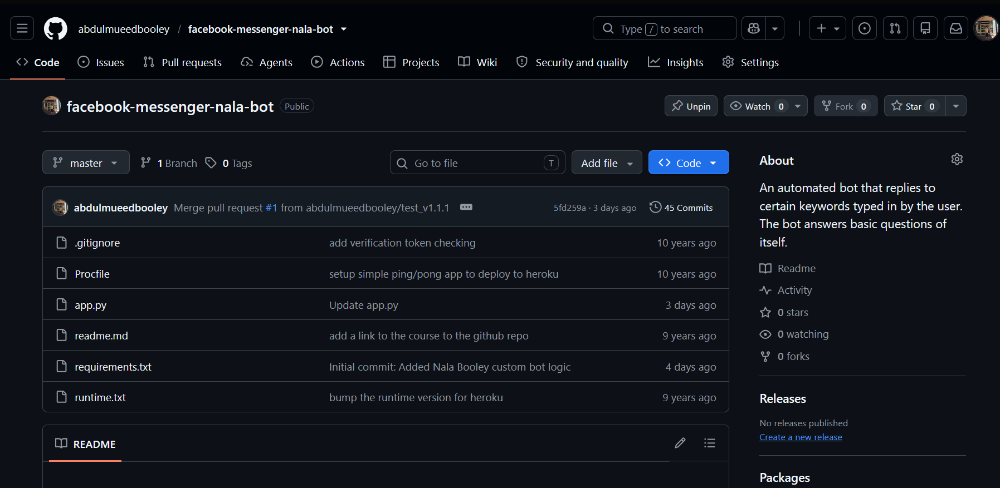
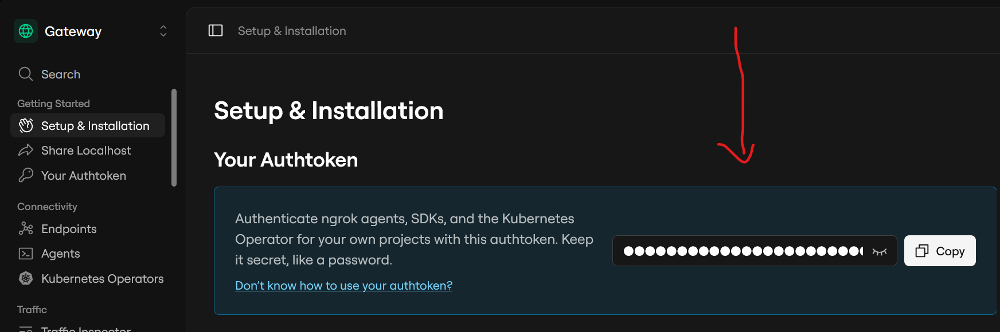
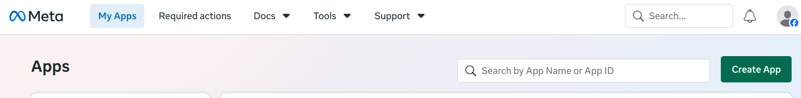
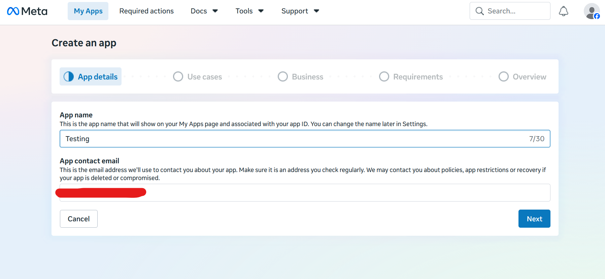
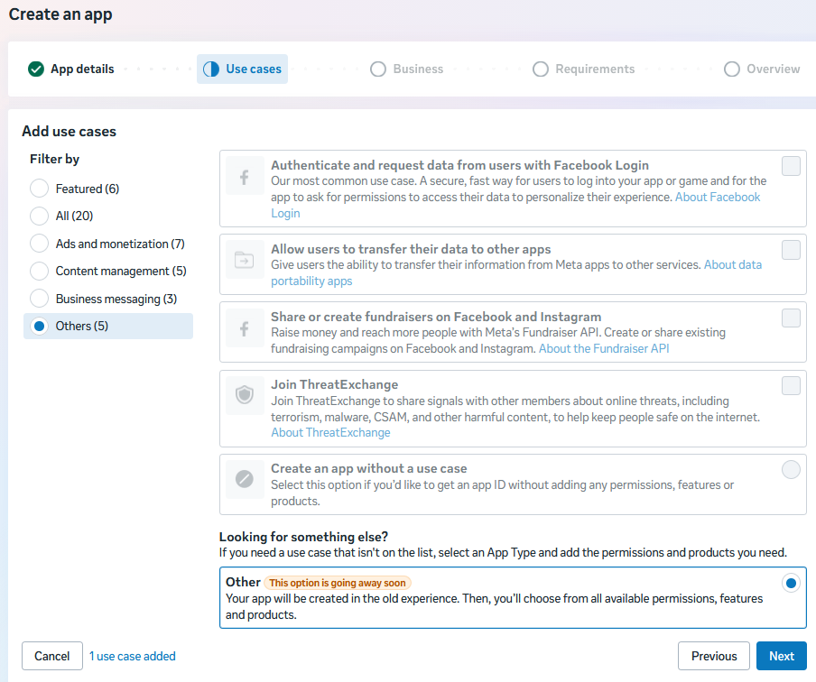
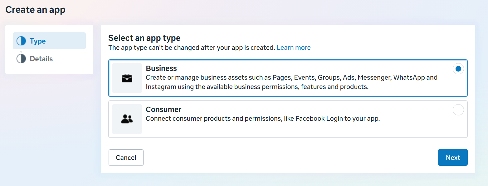
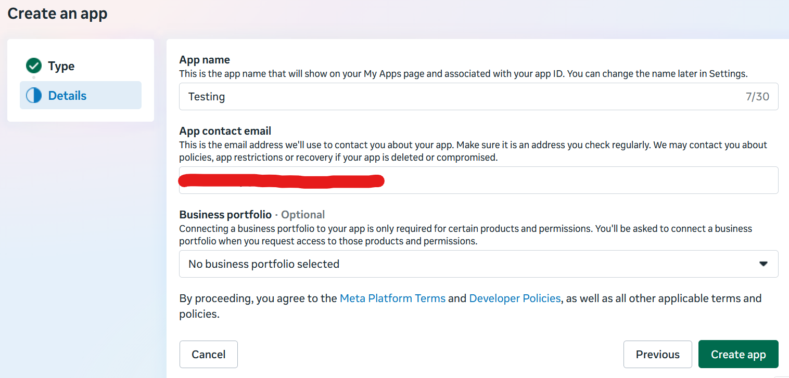
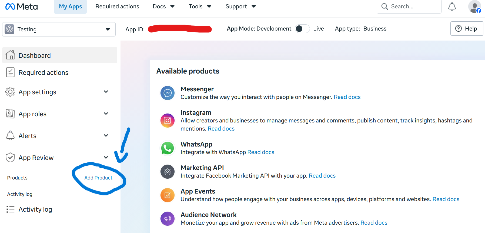
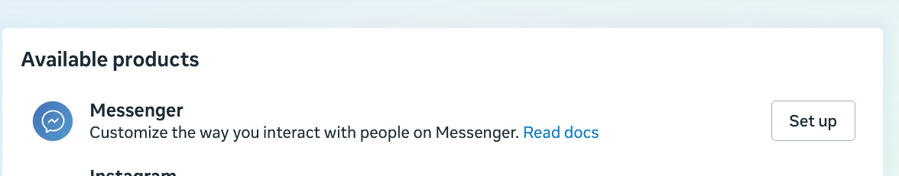
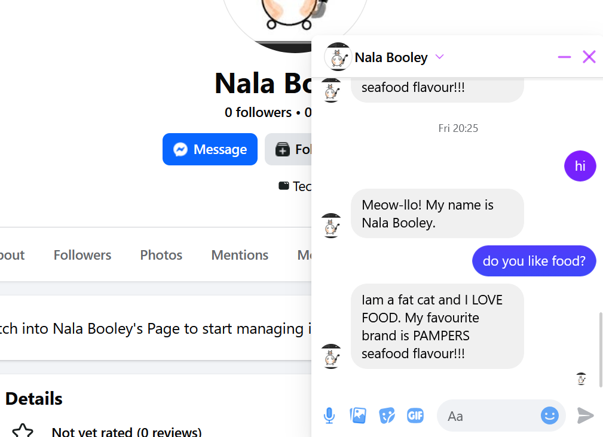

# How to make a basic Facebook Messenger Bot
# Documented Step-By-Step process:
###### Author of original source code: Hartley Brody 
###### Author of modified source code: Abdul - Mu'eed booley
 
## Step 1: We will be creating a Webhook endpoint

Before sending and receiving messages, we first need to have a working endpoint that returns a 
200 RESPONSE CODE and sends back information in order to verify your bot with FaceBook.

    
If not, install git bash to git clone my repository onto your local machine:

    git clone <https://github.com/abdulmueedbooley/facebook-messenger-nala-bot.git>

Then cd into the folder and install python dependencies:
    
    pip install -r requirements 

For testing purposes and avoiding adding credit card information i deployed my app to ngrok

What i did to setup ngrok:
 
1.) Account Creation: Go to ngrok and create a free account. <https://ngrok.com/>

2.) Download: Download the ngrok.exe file for Windows from their portal.

NOTE: Copy your authtokon as the example above

3.) Authentication: Connect your local terminal (Git bash) to your ngrok account by running your unique auth token

* `FOLLOW THESE GIT BASH COMMANDS`

        ngrok config add-authtoken <YOUR_AUTHTOKEN>
        ngrok http 5000

In order to test if everything is working smoothly on 2 SEPERATE GIT BASH terminals enter the following commands:

        ngrok http 5000

        python app.py
If you want to kill the local server press anywhere on both of your git bash terminals and enter Ctr + c.

Once you have entered those commands, in your broswer enter localhost:5000
If you see the text "Hello World" everything should be running smoothly

## Step 2: Create a FaceBook page
Create a FaceBook page if you dont have one. The page is the identity of your bot.
The name or category of your bot doesnt really matter. I named my bot after my cat NALA :)

NOTE: Meta is extremely strict with their login process so try to avoid opening multiple tabs in FaceBook, otherwise meta flags this as 
one too many requests, assuming the account is being hacked. 
I failed to sign into my main account a few times then it locked me out for 24 hours, so to combat that problem i just created 
a second account under my cats name and logged in from there.

## Step 3: Create a FaceBook app

Once you have finished creating your Facebook page create an app by following this link <https://developers.facebook.com/apps/>

### `You should be able to see a blue button called "Create app", click that and fill in the necessary information`

 

 

### `Underneathe use cases proceed to "others" option on the far left and scroll down and press the radiobutton option "Others"`

 

### `Check the "Business" option` 

### `Finally create your app`

### `Once you've landed on the developers page press "Add Product".`
### `Under "Available products" press "set up" next to the "Messenger" option`

 

## Step 4: Setup

1.) Configure Webhooks

* Call back url is your "forwarding" link in git bash

2.) Verify Tokon

* This is a special tokon, make it any way you like and save it for later.

* The tokon is important, because we need to add it to our source code 

Proceed with the necessary steps that are requested. IF YOU WANT TO DEPLOY it to the public proceed with step 3
"Complete App Review".

## Step 5: Chat with your bot

Open up app.py, dive into the source code and a comment that says "Enter tokon here" 
Enter your tokon that you created. 

